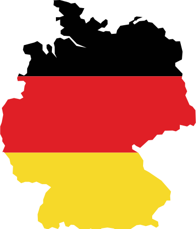

# Lesson - 01  

<br>

## Articulos determinados

| Articulo  | Pronunciacion | Genero
| ---       | ---           | ---
| DER       | dear          | masculino
| DAS       | das           | neutro
| DIE       | di            | femenino / plural


### Ejemplo

```
der Baum            -> el arbol
der Teller          -> el plato

das Haus            -> la casa
das Auto            -> el auto

die Puppe           -> la muñeca
die taschenlampe    -> la lampara

die Sterne          -> las estrellas
```


<br><br>

## Das deutsche Alphabet

| Letra         | Pronu
| ---           | ---
| A             | A
| B             | BE
| C             | TSE
| D             | DE
| E             | E
| F             | EF
| G             | GUE
| H             | JA
| I             | I
| J             | IOT
| K             | KA
| L             | EL
| M             | EM
| N             | EN
| O             | O
| P             | PE
| Q             | CU
| R             | EAR
| S             | ES
| T             | TE
| U             | U
| V             | FAU
| W             | VE
| X             | IX
| Y             | YPSILON
| Z             | TSET
| Ä (A-ÚMLAUT)  | E
| Ö (O-ÚMLAUT)  | O-U
| Ü (U-ÚMLAUT)  | I-U
| B (SS)        | ESZET

<br><br>

## Los números en alemán 
| Numero    | Deutsch   | Pronunciación
| ---       | ---       | ---
| 0         | nul       | nul
| 1         | eins      | áyns
| 2         | zwei      | tsvay
| 3         | drei      | dray
| 4         | vier      | fíia
| 5         | fünf      | fúnf
| 6         | sechs     | seks
| 7         | sieben    | síiben
| 8         | acht      | ajt
| 9         | neun      | noyn
